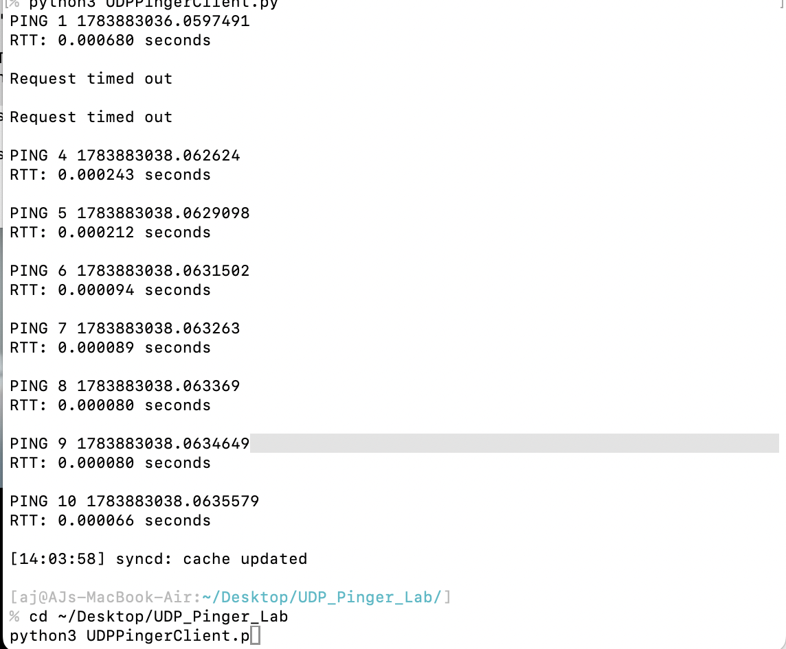
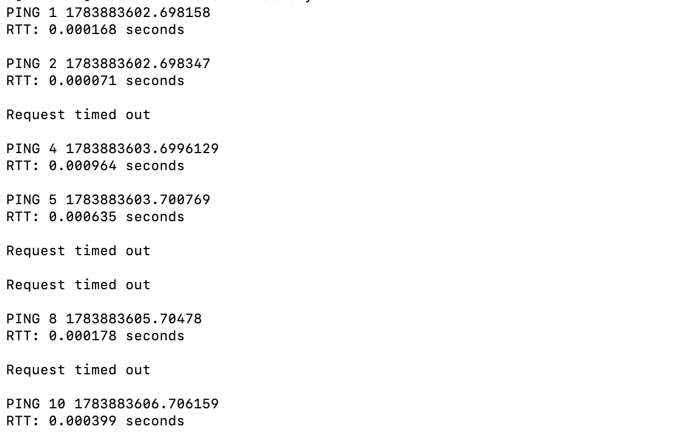

# COMP 3825: Python UDP Pinger

A Python UDP client-server application demonstrating socket programming, packet transmission, timeout handling, packet loss simulation, and round-trip time (RTT) measurement. Developed for **COMP 3825 – Computer Networks** at the University of Memphis.

---

## Project Overview

This project implements a UDP client and server using Python's socket library. The client sends ten ping requests to the server while measuring round-trip time (RTT). The server randomly drops packets to simulate an unreliable network, allowing the client to demonstrate timeout handling and packet loss recovery.

Unlike TCP, UDP does not guarantee delivery, making this project an excellent introduction to connectionless network communication.

---

## Features

- Sends 10 UDP ping requests
- Measures Round-Trip Time (RTT)
- Implements a one-second timeout
- Detects lost packets
- Simulates packet loss
- Uses UDP socket programming
- Demonstrates client-server communication

---

## Technologies Used

- Python
- UDP
- Socket Programming
- Computer Networks

---

## Skills Demonstrated

- UDP Communication
- Client-Server Architecture
- Socket Programming
- Network Programming
- RTT Measurement
- Timeout Handling
- Packet Loss Simulation

---

## Project Structure

```
python-udp-pinger/
│
├── README.md
├── UDPPingerClient.py
├── UDPPingerServer.py
└── images
    ├── client-output.png
    ├── server-running.png
    └── timeout-demo.png
```

---

## How to Run

### Start the Server

```bash
python3 UDPPingerServer.py
```

The server listens for UDP packets on **port 12000**.

### Run the Client

```bash
python3 UDPPingerClient.py
```

The client:

- Sends ten ping requests
- Measures RTT for successful packets
- Reports timeout events when packets are lost

---

## Screenshots

### UDP Server Running

The server listening for incoming UDP packets.


---

### Client Output

The client successfully sends ping requests and measures RTT values.



---

### Timeout Demonstration

The client detects packet loss and reports timeout events.



---

## What I Learned

This project strengthened my understanding of connectionless communication using UDP and demonstrated how unreliable transport protocols behave under packet loss. I gained hands-on experience with Python socket programming, client-server communication, timeout handling, and RTT measurement while reinforcing core computer networking concepts.

---

## Future Improvements

Possible enhancements include:

- Display minimum, maximum, and average RTT
- Calculate packet loss percentage
- Accept server address from the command line
- Log results to a file
- Support configurable timeout values

---

**Course:** COMP 3825 – Computer Networks  
**Language:** Python
